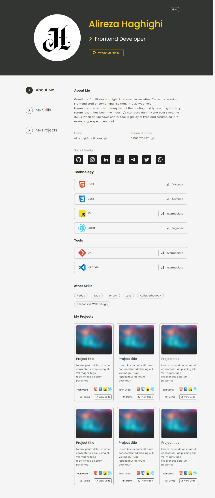

# Resume page

This is part of my exercises on learning frontend. This project is from my teacher's sample project[Samene Yaghoubi](https://github.com/SamaneYaghoobi/css) and does not use any frameworks or libraries.

